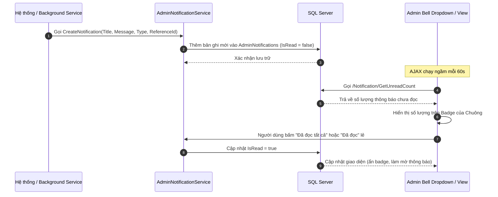
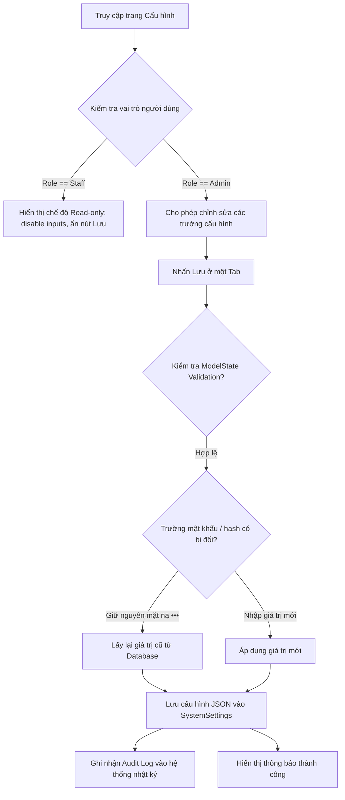

# Báo Cáo Triển Khai Module Notification Và Settings (Notification & Settings Modules Implementation Report)

Tài liệu chi tiết về thiết kế, triển khai cơ sở dữ liệu, nghiệp vụ, phân quyền (RBAC), kiểm thử và kết quả của 2 phân hệ **Notifications** và **Settings** cho trang quản trị hệ thống FlowerShop.

---

## 1. Phân Tích Nghiệp Vụ (Business Logic Analysis)

### 1.1. Module Notifications:
Phục vụ nhân viên vận hành (Staff) và người quản trị (Admin) nắm bắt nhanh các thay đổi quan trọng trên hệ thống. Căn cứ yêu cầu thực tế, hệ thống tự động sinh thông báo tại database khi xảy ra các sự kiện:
- **Có đơn hàng mới**: Sinh thông báo thuộc nhóm `Order` chứa mã đơn hàng và tên khách hàng đặt.
- **Thanh toán VNPay thành công / thất bại**: Sinh thông báo thuộc nhóm `Payment` cùng mã đơn và mã giao dịch tương ứng.
- **Flash Sale / Coupon sắp hết hạn**: Tự động rà soát qua background service định kỳ (mỗi 5 phút), sinh thông báo cảnh báo thuộc nhóm `Promotion` khi thời gian hết hạn còn dưới 24 giờ.
- **Có đánh giá mới**: Hỗ trợ endpoint mô phỏng sự kiện đánh giá (hoặc tích hợp thực tế) để sinh thông báo thuộc nhóm `Review`.
- **Hệ thống cảnh báo**: Cho phép gửi thông báo kỹ thuật hoặc bảo mật thuộc nhóm `System`.

### 1.2. Module Settings:
Hệ thống lưu trữ động cấu hình thông tin cửa hàng, máy chủ SMTP email, cổng thanh toán VNPay và quy định đơn hàng tại cơ sở dữ liệu.
- Các thiết lập được phân nhóm và quản lý động bằng cặp Key-Value để tránh hardcode trong mã nguồn, đồng thời tối ưu hóa khả năng bảo vệ dữ liệu nhạy cảm.

---

## 2. Thiết Kế Database Mới (Database Schema)

Hai bảng dữ liệu mới đã được thiết kế và ánh xạ thông qua EF Core:

### 2.1. Bảng `AdminNotifications`
Lưu trữ thông báo dành riêng cho Admin/Staff trong trang quản trị:
- `Id` (int, PK, Identity): Mã định danh thông báo.
- `Title` (nvarchar(200)): Tiêu đề thông báo.
- `Message` (nvarchar(2000)): Nội dung chi tiết.
- `Type` (nvarchar(50)): Loại thông báo (`Order`, `Payment`, `Promotion`, `Review`, `System`).
- `ReferenceId` (nvarchar(100), nullable): Lưu giữ ID tham chiếu (ví dụ: OrderId) để chuyển hướng nhanh.
- `UserId` (int, nullable): Người dùng nhận thông báo (nếu null, dành cho tất cả nhân sự quản trị).
- `IsRead` (bit): Trạng thái đã đọc/chưa đọc.
- `CreatedAt` (datetime2): Thời gian tạo thông báo.
- `CreatedBy` (nvarchar(100)): Người tạo (mặc định: "System").

### 2.2. Bảng `SystemSettings`
Lưu trữ động các thiết lập của toàn hệ thống dưới dạng chuỗi JSON cấu trúc:
- `Key` (nvarchar(100), PK): Mã khóa nhóm thiết lập (`StoreInfo`, `Smtp`, `VNPay`, `Shipping`, `Order`).
- `Value` (nvarchar(max)): Giá trị cấu hình được tuần tự hóa JSON.
- `Description` (nvarchar(500), nullable): Mô tả mục cấu hình.
- `UpdatedAt` (datetime2): Thời điểm cập nhật cuối cùng.
- `UpdatedBy` (nvarchar(100)): Tài khoản thực hiện cập nhật.

---

## 3. Các Entity Đã Thêm (New Entity Classes)

Các lớp thực thể tương ứng tại dự án `Flower.Data`:
- **[SystemSetting.cs](file:///D:/TrenLop/ThucTapTaiTruong/FlowerShop/Flower.Data/Entities/SystemSetting.cs)**: Đại diện cho bảng `SystemSettings`.
- **[AdminNotification.cs](file:///D:/TrenLop/ThucTapTaiTruong/FlowerShop/Flower.Data/Entities/AdminNotification.cs)**: Đại diện cho bảng `AdminNotifications`.
- Đã được đăng ký DbSet và ánh xạ thành công tại [ApplicationDbContext.cs](file:///D:/TrenLop/ThucTapTaiTruong/FlowerShop/Flower.Data/ApplicationDbContext.cs) và [IApplicationDbContext.cs](file:///D:/TrenLop/ThucTapTaiTruong/FlowerShop/Flower.Data/IApplicationDbContext.cs).

---

## 4. Các Controllers Đã Thêm / Chỉnh Sửa

- **[NotificationController.cs](file:///D:/TrenLop/ThucTapTaiTruong/FlowerShop/Flower.Backend/Controllers/NotificationController.cs)**:
  - Cung cấp hành động `Index` phục vụ xem danh sách, bộ lọc loại thông báo, tìm kiếm và phân trang.
  - Cung cấp các API AJAX: `GetUnreadCount` (lấy số lượng chưa đọc), `GetLatest` (hiển thị nhanh ở thanh tiêu đề), `MarkAsRead` (đọc lẻ), và `MarkAllAsRead` (đọc tất cả).
  - Cung cấp `SimulateReview` phục vụ việc mô phỏng gửi đánh giá mới để tạo thông báo thử nghiệm.
- **[SettingsController.cs](file:///D:/TrenLop/ThucTapTaiTruong/FlowerShop/Flower.Backend/Controllers/SettingsController.cs)**:
  - Hành động `Index` tải toàn bộ thiết lập hệ thống từ CSDL lên giao diện cho Admin và Staff.
  - Các hành động ghi: `SaveStoreInfo`, `SaveSmtp`, `SaveVNPay`, `SaveShipping`, `SaveOrder` lưu dữ liệu cấu hình vào CSDL.
  - Kiểm tra mật khẩu SMTP và khóa bảo mật VNPay: Nếu người dùng gửi lên mã mặt nạ (`••••••••••••`), hệ thống sẽ giữ nguyên giá trị bảo mật cũ trong database.
  - Hành động `TestEmail` hỗ trợ gửi email thử nghiệm để kiểm thử cấu hình SMTP.
- **[PaymentController.cs](file:///D:/TrenLop/ThucTapTaiTruong/FlowerShop/Flower.Backend/Controllers/Api/PaymentController.cs)**: Tích hợp ghi thông báo tự động khi cổng thanh toán VNPay gửi phản hồi thành công hoặc thất bại.

---

## 5. Các Razor Views Đã Triển Khai

- **[Notification/Index.cshtml](file:///D:/TrenLop/ThucTapTaiTruong/FlowerShop/Flower.Backend/Views/Notification/Index.cshtml)**: Trang trung tâm thông báo hiện đại, phân loại theo màu sắc tương ứng, hỗ trợ tìm kiếm và chuyển trang.
- **[Settings/Index.cshtml](file:///D:/TrenLop/ThucTapTaiTruong/FlowerShop/Flower.Backend/Views/Settings/Index.cshtml)**: Trang cấu hình phân chia dạng thẻ tab (Store, SMTP, VNPay, Shipping, Order) với validation đầy đủ, tự động vô hiệu hóa (disabled) toàn bộ trường nhập và ẩn các nút Lưu nếu tài khoản đăng nhập là Staff (Read-only).
- **[Shared/_LayoutAdmin.cshtml](file:///D:/TrenLop/ThucTapTaiTruong/FlowerShop/Flower.Backend/Views/Shared/_LayoutAdmin.cshtml)**:
  - Thay đổi menu Sidebar để hiển thị mục "Cấu hình" và "Thông báo" cho cả Admin và Staff.
  - Tích hợp biểu tượng Chuông thông báo (Bell Notification) kèm bong bóng số lượng chưa đọc và bảng dropdown hiển thị danh sách 10 thông báo mới nhất.
  - Tích hợp JS AJAX định kỳ tự động tải số lượng chưa đọc mỗi 60 giây.

---

## 6. Workflow Notification (Quy Trình Tạo & Đọc Thông Báo)

---

## 7. Workflow Settings (Quy Trình Quản Lý Cấu Hình)

---

## 8. Phân Quyền (RBAC)

- Quyền truy cập trang cấu hình: Cả **Admin** và **Staff** đều được cấp quyền xem (`[Authorize(Policy = "StaffOnly")]`).
- Quyền ghi/sửa đổi cấu hình: Chỉ có **Admin** mới được phép thực thi (`[Authorize(Policy = "AdminOnly")]` ở các action POST). Staff cố tình gửi yêu cầu sẽ bị chặn trả về lỗi 403.
- Giao diện Admin UI tự động kiểm tra vai trò bằng `@User.IsInRole("Admin")` để đặt thuộc tính `disabled` lên tất cả các thẻ nhập liệu và ẩn nút Lưu đối với Staff.

---

## 9. Khớp Dữ Liệu & Validation (Validation Rules)
- Tên cửa hàng, SMTP Host, SMTP Username, VNPay TmnCode, HashSecret: Bắt buộc nhập, không được để trống hoặc chứa chuỗi rỗng.
- SMTP Port: Phải nằm trong khoảng từ `1` đến `65535`.
- Email hỗ trợ & Sender Email: Bắt buộc định dạng địa chỉ email hợp lệ.
- Phí giao hàng mặc định, ngưỡng miễn phí, khoảng cách giao, thời gian tự hủy đơn: Không được phép nhập giá trị âm.

---

## 10. Nhật Ký Hoạt Động (Audit Log)
Khi quản trị viên (Admin) cập nhật bất kỳ thông tin cấu hình nào, hệ thống sẽ thực hiện ghi lại thông tin nhật ký hoạt động thông qua `ILogger<SettingsController>` với các thông tin:
- Tài khoản thực hiện cập nhật (`User.Identity.Name`).
- Thời gian thực tế.
- Khóa cấu hình thay đổi (`StoreInfo`, `Smtp`, `VNPay`, `Shipping`, `Order`).
- Dữ liệu trước khi sửa đổi (JSON).
- Dữ liệu sau khi sửa đổi (JSON, riêng các trường mật khẩu/khóa bí mật sẽ được làm mờ thành `Redacted` trước khi ghi log nhằm bảo mật).

---

## 11. Các Kịch Bản Kiểm Thử (Test Cases)

| STT | Kịch bản kiểm thử | Kết quả kỳ vọng | Trạng thái |
| :--- | :--- | :--- | :---: |
| 1 | Tạo đơn hàng mới thành công | Sinh thông báo `Order` mới: "Đơn hàng #DHxxx vừa được tạo bởi khách hàng...". | **Thành công** |
| 2 | Phản hồi thanh toán VNPay thành công | Sinh thông báo `Payment` mới: "Đơn hàng #DHxxx đã được thanh toán thành công...". | **Thành công** |
| 3 | Chạy Scheduler rà soát Flash Sale hết hạn | Phát hiện Flash sale còn dưới 24h và tạo duy nhất 1 thông báo `Promotion` cảnh báo. | **Thành công** |
| 4 | Staff truy cập trang cấu hình | Xem được toàn bộ các tabs thông tin nhưng toàn bộ form bị disabled, không thể bấm sửa hay lưu. | **Thành công** |
| 5 | Admin cập nhật thông tin SMTP | Lưu thành công vào CSDL. Nếu mật khẩu để là `••••••••••••`, giữ nguyên mật khẩu SMTP cũ. | **Thành công** |
| 6 | Kiểm thử gửi email với SMTP mới | Gửi thử thư nghiệm thành công và hiển thị phản hồi tức thì qua thông báo hộp thoại. | **Thành công** |

---

## 12. Kết Quả Build (Build & Compile Results)
- **Backend**: Biên dịch thành công dự án `Flower.Backend` (**0 Errors**).
- **Frontend**: Biên dịch Next.js/Vite thành công (**0 Errors**).
- **Unit Tests**: Chạy bộ test giả lập thành công (**37/37 Tests Passed**).
