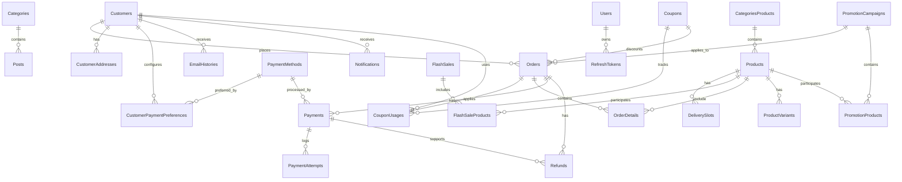

# Database Relationships (FlowerShop)

Tài liệu này chi tiết toàn bộ các mối quan hệ (Relationships) giữa các bảng trong cơ sở dữ liệu của FlowerShop, được trích xuất từ Entity Framework Core DbContext, Migration và Model Snapshot.

---

## Danh sách các mối quan hệ (1 - N, 1 - 1)

### 1. Categories và Posts
Mối quan hệ giữa danh mục tin tức và các bài viết.
- **Categories**
- 1 ---- N
- **Posts**

### 2. CategoriesProducts và Products
Mối quan hệ giữa danh mục sản phẩm và các sản phẩm hoa.
- **CategoriesProducts**
- 1 ---- N
- **Products**

### 3. Customers và Orders
Mối quan hệ giữa khách hàng và các đơn hàng đã đặt.
- **Customers**
- 1 ---- N
- **Orders**

### 4. Customers và CustomerAddresses
Mối quan hệ giữa khách hàng và danh sách địa chỉ giao hàng.
- **Customers**
- 1 ---- N
- **CustomerAddresses**

### 5. Customers và CustomerPaymentPreferences
Mối quan hệ giữa khách hàng và các tùy chọn phương thức thanh toán ưa thích.
- **Customers**
- 1 ---- N
- **CustomerPaymentPreferences**

### 6. PaymentMethods và CustomerPaymentPreferences
Mối quan hệ giữa phương thức thanh toán định nghĩa và cấu hình ưu tiên của khách hàng.
- **PaymentMethods**
- 1 ---- N
- **CustomerPaymentPreferences**

### 7. Products và DeliverySlots
Mối quan hệ giữa sản phẩm và các slot thời gian giao hàng được thiết lập.
- **Products**
- 1 ---- N
- **DeliverySlots**

### 8. Customers và EmailHistories
Mối quan hệ giữa khách hàng và lịch sử email nhận được.
- **Customers**
- 1 ---- N
- **EmailHistories**

### 9. FlashSales và FlashSaleProducts
Mối quan hệ giữa chiến dịch Flash Sale và các sản phẩm được áp dụng giá khuyến mãi.
- **FlashSales**
- 1 ---- N
- **FlashSaleProducts**

### 10. Products và FlashSaleProducts
Mối quan hệ giữa sản phẩm chính và chi tiết sản phẩm trong chiến dịch Flash Sale.
- **Products**
- 1 ---- N
- **FlashSaleProducts**

### 11. Customers và Notifications
Mối quan hệ giữa khách hàng và các thông báo hệ thống nhận được.
- **Customers**
- 1 ---- N
- **Notifications**

### 12. Coupons và CouponUsages
Mối quan hệ giữa mã giảm giá và lịch sử sử dụng mã giảm giá đó.
- **Coupons**
- 1 ---- N
- **CouponUsages**

### 13. Customers và CouponUsages
Mối quan hệ giữa khách hàng và lịch sử sử dụng mã giảm giá của họ.
- **Customers**
- 1 ---- N
- **CouponUsages**

### 14. Orders và CouponUsages
Mối quan hệ 1-1 giữa đơn hàng và lượt sử dụng mã giảm giá (Mỗi đơn hàng áp dụng tối đa một Coupon).
- **Orders**
- 1 ---- 1
- **CouponUsages**

### 15. Orders và OrderDetails
Mối quan hệ giữa đơn hàng và danh sách các sản phẩm chi tiết của đơn hàng đó.
- **Orders**
- 1 ---- N
- **OrderDetails**

### 16. Products và OrderDetails
Mối quan hệ giữa sản phẩm gốc và chi tiết dòng đơn hàng.
- **Products**
- 1 ---- N
- **OrderDetails**

### 17. PromotionCampaigns và Orders
Mối quan hệ giữa chiến dịch khuyến mãi tích hợp và đơn hàng áp dụng khuyến mãi đó.
- **PromotionCampaigns**
- 1 ---- N
- **Orders**

### 18. Coupons và Orders
Mối quan hệ giữa mã Coupon và đơn hàng áp dụng Coupon.
- **Coupons**
- 1 ---- N
- **Orders**

### 19. Orders và Payments
Mối quan hệ giữa đơn hàng và các đợt thanh toán liên quan.
- **Orders**
- 1 ---- N
- **Payments**

### 20. PaymentMethods và Payments
Mối quan hệ giữa định nghĩa phương thức thanh toán và các bản ghi thanh toán cụ thể.
- **PaymentMethods**
- 1 ---- N
- **Payments**

### 21. Payments và PaymentAttempts
Mối quan hệ giữa bản ghi thanh toán và lịch sử các lượt cố gắng thanh toán qua gateway.
- **Payments**
- 1 ---- N
- **PaymentAttempts**

### 22. Products và ProductVariants
Mối quan hệ giữa sản phẩm chính và các biến thể sản phẩm (Kích thước, kiểu cắm...).
- **Products**
- 1 ---- N
- **ProductVariants**

### 23. PromotionCampaigns và PromotionProducts
Mối quan hệ giữa chiến dịch khuyến mãi lớn và danh sách sản phẩm được áp dụng.
- **PromotionCampaigns**
- 1 ---- N
- **PromotionProducts**

### 24. Products và PromotionProducts
Mối quan hệ giữa sản phẩm và thông tin khuyến mãi đi kèm.
- **Products**
- 1 ---- N
- **PromotionProducts**

### 25. Users và RefreshTokens
Mối quan hệ giữa người dùng hệ thống quản trị và các refresh token gia hạn phiên đăng nhập.
- **Users**
- 1 ---- N
- **RefreshTokens**

### 26. Orders và Refunds
Mối quan hệ giữa đơn hàng và các yêu cầu hoàn tiền.
- **Orders**
- 1 ---- N
- **Refunds**

### 27. Payments và Refunds
Mối quan hệ giữa bản ghi thanh toán gốc và bản ghi hoàn tiền phát sinh.
- **Payments**
- 1 ---- N
- **Refunds**

---

## Sơ đồ quan hệ thực thể (ER Diagram)

Dưới đây là sơ đồ quan hệ thực thể của toàn bộ hệ thống cơ sở dữ liệu FlowerShop, được hiển thị bằng cú pháp Mermaid ER:

