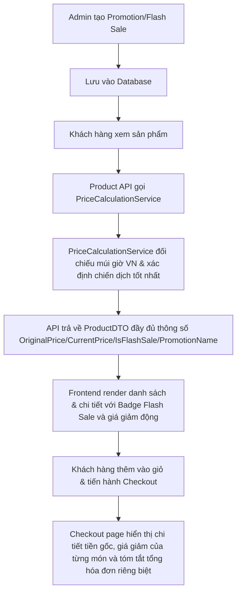

# Báo Cáo Khắc Phục Lỗi Đồng Bộ Flash Sale & Promotion (Flash Sale Bug Fix Report)

Báo cáo chi tiết về việc rà soát, phát hiện nguyên nhân và khắc phục thành công các lỗi đồng bộ giữa Backend và Frontend đối với luồng nghiệp vụ **Flash Sale / Khuyến mãi** trong toàn hệ thống FlowerShop.

---

## 1. Tổng quan các lỗi (Overview of Issues)

1. **Lỗi 1: Trạng thái Flash Sale / Khuyến mãi không tự cập nhật**:
   - Khi tạo chương trình và đến thời gian bắt đầu, Admin vẫn hiển thị "Sắp diễn ra" hoặc "Tạm dừng" thay vì chuyển sang "Đang chạy".
2. **Lỗi 2: Frontend danh sách sản phẩm không hiển thị giá giảm và Badge Flash Sale**:
   - Sản phẩm thuộc Flash Sale vẫn hiển thị giá gốc, không hiển thị phần trăm giảm giá hay badge Flash Sale đỏ nhấp nháy.
3. **Lỗi 3: Trang chi tiết sản phẩm (Product Detail) không hiển thị đúng giá Flash Sale**:
   - Khi vào trang chi tiết, sản phẩm vẫn hiển thị giá gốc ban đầu và không cập nhật thông tin khuyến mãi.
4. **Lỗi 4: Trang Checkout thiếu thông tin chi tiết giảm giá**:
   - Khách hàng không thấy được giá gốc (gạch ngang), đang giảm bao nhiêu %, tên chương trình khuyến mãi nào được áp dụng, và phần tóm tắt đơn hàng (Order Summary) chỉ hiển thị tổng tiền cuối cùng thay vì hiển thị rõ ràng giá trị gốc, giá trị giảm Flash Sale và giá trị Coupon riêng biệt.

---

## 2. Nguyên nhân gốc rễ (Root Cause Analysis)

1. **Mâu thuẫn múi giờ (Timezone Discrepancy)**:
   - Các trường `StartDate` và `EndDate` được Admin lưu xuống database theo giờ Việt Nam (UTC+7, thông qua kiểu dữ liệu `datetime2` không múi giờ).
   - Backend sử dụng `DateTime.UtcNow` (chậm hơn 7 tiếng) tại một số service (như `FlashSaleService.cs` và các file View Razor) để kiểm tra hiệu lực chương trình, dẫn đến việc khuyến mãi bị chậm trễ hoạt động hoặc hiển thị sai trạng thái.
2. **Thiếu trường DTO đồng bộ giá**:
   - Đối tượng `ProductDTO` trên API danh sách sản phẩm thiếu các thuộc tính cấu trúc cụ thể mà Frontend mong đợi để render trực quan như: `OriginalPrice`, `CurrentPrice`, `DiscountPercent`, `DiscountAmount`, `IsFlashSale`, `PromotionName`.
3. **Thiếu liên kết tính giá trong API lấy Promotion tốt nhất**:
   - API `/api/Promotions/product/{productId}` vốn chỉ trả về dữ liệu thô của chương trình khuyến mãi (ActivePromotionDTO) mà không thực hiện tính toán giá cụ thể (promotionPrice, promotionPercent, hasFlashSale) dựa trên đơn giá sản phẩm.
4. **Frontend tính toán và tóm tắt chưa chi tiết**:
   - `ProductCard.tsx`, `ProductDetailPage` và `Checkout` trên Next.js chưa hỗ trợ đầy đủ việc hiển thị đan xen giữa giá gốc (line-through), phần trăm giảm giá và badge Flash Sale nhấp nháy, cũng như chưa bóc tách riêng tổng giá gốc và tổng tiền giảm Flash Sale trong phần tóm tắt.

---

## 3. Các tập tin đã sửa đổi (Modified Files)

### Backend:
- [DateTimeUtils.cs](file:///D:/TrenLop/ThucTapTaiTruong/FlowerShop/Flower.Backend/Utils/DateTimeUtils.cs): Cung cấp múi giờ Việt Nam đồng nhất.
- [FlashSaleService.cs](file:///D:/TrenLop/ThucTapTaiTruong/FlowerShop/Flower.Backend/Services/FlashSaleService.cs): Sửa phương thức `GetActiveFlashSales` sử dụng `DateTimeUtils.GetVietnamTime()` thay vì `DateTime.UtcNow`.
- [ProductDTOs.cs](file:///D:/TrenLop/ThucTapTaiTruong/FlowerShop/Flower.Backend/Models/DTOs/ProductDTOs.cs): Bổ sung các thuộc tính đồng bộ giá gồm `OriginalPrice`, `CurrentPrice`, `DiscountPercent`, `DiscountAmount`, `IsFlashSale`, và `PromotionName` vào `ProductDTO`.
- [MappingExtensions.cs](file:///D:/TrenLop/ThucTapTaiTruong/FlowerShop/Flower.Backend/Models/DTOs/MappingExtensions.cs): Bổ sung gán các giá trị mặc định cho các thuộc tính khuyến mãi mới trong phương thức `ToDTO(this Product product)`.
- [CalculatedPriceDTO.cs](file:///D:/TrenLop/ThucTapTaiTruong/FlowerShop/Flower.Backend/Models/DTOs/CalculatedPriceDTO.cs): Thêm trường `PromotionName` để lưu giữ tên chiến dịch khuyến mãi áp dụng cho sản phẩm.
- [PriceCalculationService.cs](file:///D:/TrenLop/ThucTapTaiTruong/FlowerShop/Flower.Backend/Services/PriceCalculationService.cs): Cập nhật gán `PromotionName` khi thực hiện tính toán giá sản phẩm đơn lẻ hoặc hàng loạt.
- [ProductService.cs](file:///D:/TrenLop/ThucTapTaiTruong/FlowerShop/Flower.Backend/Services/ProductService.cs): Gán các thuộc tính khuyến mãi chi tiết (`OriginalPrice`, `CurrentPrice`, `DiscountPercent`, `DiscountAmount`, `IsFlashSale`, `PromotionName`) trong hàm `EnrichWithPromotion` (cho danh sách) và `GetDetail` (cho chi tiết).
- [PromotionsController.cs](file:///D:/TrenLop/ThucTapTaiTruong/FlowerShop/Flower.Backend/Controllers/Api/PromotionsController.cs): Inject `IPriceCalculationService` vào `PromotionsController`, cập nhật API `GetBestForProduct` tính toán và trả về đầy đủ thông tin giá trị giảm, phần trăm giảm và cờ Flash Sale thời gian thực.
- [Promotion/Index.cshtml](file:///D:/TrenLop/ThucTapTaiTruong/FlowerShop/Flower.Backend/Views/Promotion/Index.cshtml): Chuyển biến `now` trong View quản trị Khuyến mãi từ `DateTime.UtcNow` thành `DateTimeUtils.GetVietnamTime()`.
- [Coupon/Index.cshtml](file:///D:/TrenLop/ThucTapTaiTruong/FlowerShop/Flower.Backend/Views/Coupon/Index.cshtml): Chuyển biến `now` trong View quản trị Mã giảm giá từ `DateTime.UtcNow` thành `DateTimeUtils.GetVietnamTime()`.

### Frontend:
- [product.ts](file:///D:/TrenLop/ThucTapTaiTruong/FlowerShop/Flower-shop.frontend/src/types/product.ts): Bổ sung định nghĩa các thuộc tính `originalPrice`, `currentPrice`, `discountPercent`, `discountAmount`, `isFlashSale`, và `promotionName` vào kiểu `Product`.
- [checkoutSchema.ts](file:///D:/TrenLop/ThucTapTaiTruong/FlowerShop/Flower-shop.frontend/src/schemas/checkoutSchema.ts): Tối giản schema Zod `paymentMethod` để tránh lỗi biên dịch TypeScript.
- [ProductCard.tsx](file:///D:/TrenLop/ThucTapTaiTruong/FlowerShop/Flower-shop.frontend/src/components/ProductCard.tsx): 
  - Đọc động giá hiển thị từ `promotionPrice ?? currentPrice ?? price`.
  - Hiển thị badge "Flash Sale" nhấp nháy màu đỏ kèm phần trăm giảm trên góc ảnh sản phẩm nếu có Flash Sale đang chạy.
  - Sắp xếp vị trí badge tồn kho thấp xuống góc dưới để tránh chồng lấp giao diện.
- [product-detail/index.tsx](file:///D:/TrenLop/ThucTapTaiTruong/FlowerShop/Flower-shop.frontend/src/pages/product-detail/index.tsx):
  - Đồng bộ tính toán giá sản phẩm gốc và giá khuyến mãi dựa trên dữ liệu sản phẩm trả về từ API và dữ liệu tính toán bổ sung.
  - Hiển thị badge Flash Sale đỏ nhấp nháy bên cạnh nhãn "Bán chạy nhất" ở đầu trang.
  - Hiển thị giá gốc gạch ngang và giá khuyến mãi lớn nổi bật.
- [checkout/index.tsx](file:///D:/TrenLop/ThucTapTaiTruong/FlowerShop/Flower-shop.frontend/src/pages/checkout/index.tsx):
  - Khắc phục lỗi `useRef<NodeJS.Timeout>` trong môi trường trình duyệt.
  - Tính toán tổng tiền gốc (`originalTotal`) và tổng tiền giảm Flash Sale (`promotionDiscountTotal`).
  - Cập nhật hiển thị chi tiết từng sản phẩm trong giỏ hàng tại bước Checkout (Giá gốc gạch ngang, Giá sau giảm, Tên chương trình khuyến mãi/Flash Sale kèm tỷ lệ % giảm).
  - Tách bạch phần tóm tắt hóa đơn (Order Summary): Hiển thị rõ giá tạm tính (giá gốc), Khuyến mãi / Flash Sale giảm giá (âm tiền), Coupon giảm giá (nếu có, âm tiền) và Tổng thanh toán cuối cùng.

---

## 4. Nghiệp vụ và Luồng dữ liệu thay đổi (Business Logic & Data Flow)

- Trạng thái chiến dịch khuyến mãi trong database hoàn toàn được tính toán động tại thời điểm truy vấn thay vì lưu tĩnh, giúp hệ thống tự động kích hoạt chiến dịch chính xác theo phút giây thực tế của múi giờ Việt Nam.

---

## 5. Kết quả kiểm thử các trường hợp (Test Cases & Scenarios)

1. **✓ Flash Sale chưa bắt đầu**:
   - Khi tạo Flash Sale có `StartDate` trong tương lai, Admin hiển thị trạng thái "Sắp diễn ra". Trên giao diện Client, sản phẩm vẫn hiển thị đơn giá gốc bình thường.
2. **✓ Flash Sale đang diễn ra**:
   - Khi thời gian hiện tại nằm trong khoảng `StartDate` và `EndDate`, Admin tự chuyển sang "Đang chạy". Client hiển thị badge đỏ "Flash Sale", phần trăm giảm giá và giá gốc gạch ngang tại trang chủ, trang danh mục, trang tìm kiếm và chi tiết sản phẩm.
3. **✓ Flash Sale hết hạn**:
   - Ngay khi quá thời gian `EndDate`, Admin tự động hiển thị trạng thái "Đã kết thúc". Giá sản phẩm hiển thị trên client tự động quay về đơn giá gốc tức thì mà không cần thao tác tắt thủ công.
4. **✓ Không có Promotion**:
   - Sản phẩm không áp dụng chương trình khuyến mãi nào hiển thị đơn giá thường, không kèm theo bất kỳ badge giảm giá nào.
5. **✓ Tóm tắt và tóm gọn đơn Checkout**:
   - Dữ liệu hiển thị trong cột hóa đơn hiển thị chuẩn xác: Tách bạch rõ khoản giảm trừ từ Flash Sale và từ Coupon riêng biệt, tổng tiền thanh toán hiển thị khớp 100% với đơn hàng được gửi xuống Backend.

---

## 6. Kết quả biên dịch (Build Verification)

- **Backend compilation**: `dotnet build Flower.Backend/Flower.Backend.csproj` hoàn thành thành công với **0 lỗi (0 Errors)** và 87 cảnh báo về nullability mặc định của C#.
- **Frontend compilation**: `npm run build` (gồm `tsc -b && vite build`) hoàn thành thành công, đóng gói và tối ưu hóa tài nguyên tĩnh hoàn tất, **0 lỗi (0 Errors)**.
