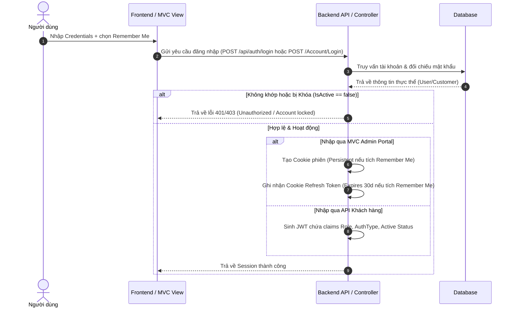

# Báo Cáo Khắc Phục Lỗ Hổng Bảo Mật Xác Thực & Phân Quyền (Authentication & Authorization Security Fix Report)

Báo cáo chi tiết về nguyên nhân lỗi, các bước đã thực hiện để vá lỗ hổng bảo mật, cấu trúc luồng xác thực mới và kết quả kiểm thử hệ thống FlowerShop.

---

## 1. Nguyên nhân từng lỗi (Root Causes)

### LỖI 1: Admin Login cho phép Customer đăng nhập
- **Nguyên nhân**: API/Phương thức `_authService.Login(username, password)` thực hiện truy vấn cả hai bảng `Users` và `Customers`. Trang đăng nhập Admin MVC (`AccountController`) gọi phương thức này và trực tiếp cấp cookie xác thực nếu đăng nhập đúng, mà không kiểm tra xem tài khoản đó thuộc đối tượng khách hàng (`Customer`) hay quản trị (`User`), và cũng không kiểm tra trạng thái hoạt động (`IsActive`).

### LỖI 2: Customer đăng nhập thành Admin
- **Nguyên nhân**: 
  1. API đăng nhập của khách hàng (`AuthController.cs`) tự động gọi `HttpContext.SignInAsync` để tạo cookie phiên bản MVC của Admin trong trình duyệt của người dùng.
  2. Hầu hết các Controller trong hệ thống quản trị MVC (ví dụ `ProductController`, `PromotionController`,...) chỉ khai báo thuộc tính `[Authorize]` ở cấp lớp mà không chỉ định policy hoặc role cụ thể. Do đó, bất kỳ tài khoản nào được xác thực (kể cả Customer với cookie phiên đăng nhập) đều được phép truy cập và thực hiện thao tác sửa đổi.

### LỖI 3: Restart Backend vẫn đăng nhập Admin (Lỗi quản lý Session)
- **Nguyên nhân**: Trước đây, cookie xác thực và refresh token cookie (`X-Refresh-Token`) có thời gian sống cố định là 30 ngày (persistent). Khi restart backend, nếu khóa Data Protection lưu trên disk thì cookie vẫn giải mã thành công, cho phép người dùng duy trì trạng thái đăng nhập vô thời hạn kể cả khi họ không chọn chức năng "Ghi nhớ đăng nhập" (Remember Me).
- Đồng thời, middleware `SessionValidationMiddleware` không truy vấn cơ sở dữ liệu để xác thực chéo trạng thái `IsActive` thực tế của tài khoản, dẫn đến việc tài khoản bị vô hiệu hóa (disabled/locked) hoặc thay đổi quyền hạn vẫn có thể truy cập hệ thống bằng session cũ.

### LỖI 4: Mất đồng bộ Session giữa Admin và Customer
- **Nguyên nhân**: Frontend lưu giữ JWT token của khách hàng trong `sessionStorage` (bị xóa khi đóng trình duyệt), trong khi Cookie Admin lại được cấu hình thời hạn 30 ngày theo mặc định. Điều này tạo ra sự mâu thuẫn lớn trong cơ chế duy trì phiên làm việc.

---

## 2. Các file đã sửa (Modified Files)

### Backend:
- [AuthResult.cs](file:///D:/TrenLop/ThucTapTaiTruong/FlowerShop/Flower.Backend/Models/DTOs/AuthResult.cs): Bổ sung thuộc tính `IsActive` vào `LoginResult`.
- [AuthDTOs.cs](file:///D:/TrenLop/ThucTapTaiTruong/FlowerShop/Flower.Backend/Models/DTOs/AuthDTOs.cs): Bổ sung `RememberMe` vào `LoginRequest` DTO.
- [AuthService.cs](file:///D:/TrenLop/ThucTapTaiTruong/FlowerShop/Flower.Backend/Services/AuthService.cs): Ánh xạ chính xác cờ `IsActive` từ thực thể CSDL sang `LoginResult` cho cả User và Customer.
- [AccountController.cs](file:///D:/TrenLop/ThucTapTaiTruong/FlowerShop/Flower.Backend/Controllers/AccountController.cs):
  - Chặn đăng nhập nếu đối tượng đăng nhập không thuộc phân hệ `User` hoặc không có role `Admin`/`Staff`.
  - Từ chối đăng nhập nếu tài khoản bị khóa (`IsActive == false`).
  - Hỗ trợ tham số `rememberMe` để thiết lập thời gian sống của cookie và refresh token động (dùng session cookie nếu không tích chọn).
- [AuthController.cs](file:///D:/TrenLop/ThucTapTaiTruong/FlowerShop/Flower.Backend/Controllers/Api/AuthController.cs):
  - Kiểm tra trạng thái `IsActive` của tài khoản, trả về `403 Forbidden` nếu tài khoản bị vô hiệu hóa.
  - Loại bỏ hoàn toàn dòng lệnh `HttpContext.SignInAsync` để tránh tạo cookie xác thực Admin cho khách hàng.
- [SessionValidationMiddleware.cs](file:///D:/TrenLop/ThucTapTaiTruong/FlowerShop/Flower.Backend/Middleware/SessionValidationMiddleware.cs):
  - Thực hiện xác thực chéo (Active Validation) trực tiếp với database trên mỗi request dựa trên `AuthType` và `Id`.
  - Nếu tài khoản bị vô hiệu hóa (`IsActive == false`) hoặc thay đổi role, lập tức thu hồi token, xóa cookie và đăng xuất người dùng (trả về 401 cho API hoặc redirect về Login cho MVC).
- [Program.cs](file:///D:/TrenLop/ThucTapTaiTruong/FlowerShop/Flower.Backend/Program.cs): Khai báo tường minh `NameClaimType` và `RoleClaimType` trong `TokenValidationParameters` của JWT Bearer để cơ chế phân quyền policy hoạt động chính xác.
- **MVC Admin Controllers**: Thay thế `[Authorize]` chung chung thành `[Authorize(Policy = "StaffOnly")]` hoặc `[Authorize(Policy = "AdminOnly")]` để phân quyền chặt chẽ:
  - [ProductController.cs](file:///D:/TrenLop/ThucTapTaiTruong/FlowerShop/Flower.Backend/Controllers/ProductController.cs)
  - [CategoryController.cs](file:///D:/TrenLop/ThucTapTaiTruong/FlowerShop/Flower.Backend/Controllers/CategoryController.cs)
  - [CategoryProductController.cs](file:///D:/TrenLop/ThucTapTaiTruong/FlowerShop/Flower.Backend/Controllers/CategoryProductController.cs)
  - [PromotionController.cs](file:///D:/TrenLop/ThucTapTaiTruong/FlowerShop/Flower.Backend/Controllers/PromotionController.cs)
  - [CouponController.cs](file:///D:/TrenLop/ThucTapTaiTruong/FlowerShop/Flower.Backend/Controllers/CouponController.cs)
  - [OrderController.cs](file:///D:/TrenLop/ThucTapTaiTruong/FlowerShop/Flower.Backend/Controllers/OrderController.cs)
  - [OrderDetailController.cs](file:///D:/TrenLop/ThucTapTaiTruong/FlowerShop/Flower.Backend/Controllers/OrderDetailController.cs)
  - [CustomerController.cs](file:///D:/TrenLop/ThucTapTaiTruong/FlowerShop/Flower.Backend/Controllers/CustomerController.cs)
  - [UserController.cs](file:///D:/TrenLop/ThucTapTaiTruong/FlowerShop/Flower.Backend/Controllers/UserController.cs)
  - [AdvertisementController.cs](file:///D:/TrenLop/ThucTapTaiTruong/FlowerShop/Flower.Backend/Controllers/AdvertisementController.cs)
  - [PostController.cs](file:///D:/TrenLop/ThucTapTaiTruong/FlowerShop/Flower.Backend/Controllers/PostController.cs)

### MVC Views:
- [Login.cshtml](file:///D:/TrenLop/ThucTapTaiTruong/FlowerShop/Flower.Backend/Views/Account/Login.cshtml): Bổ sung checkbox "Ghi nhớ đăng nhập" (rememberMe).

### Frontend (React/Next.js):
- [loginSchema.ts](file:///D:/TrenLop/ThucTapTaiTruong/FlowerShop/Flower-shop.frontend/src/schemas/loginSchema.ts): Bổ sung trường `rememberMe` vào Zod schema.
- [tokenService.ts](file:///D:/TrenLop/ThucTapTaiTruong/FlowerShop/Flower-shop.frontend/src/services/tokenService.ts): Tối ưu hàm `setToken` ghi nhận token vào `localStorage` nếu chọn Remember Me, ngược lại ghi vào `sessionStorage` để tự hủy phiên khi tắt trình duyệt.
- [authService.ts](file:///D:/TrenLop/ThucTapTaiTruong/FlowerShop/Flower-shop.frontend/src/services/authService.ts): Truyền tham số `rememberMe` lên API Backend.
- [AuthContext.tsx](file:///D:/TrenLop/ThucTapTaiTruong/FlowerShop/Flower-shop.frontend/src/context/AuthContext.tsx): Cập nhật hàm `login` nhận cờ `rememberMe`.
- [login/index.tsx](file:///D:/TrenLop/ThucTapTaiTruong/FlowerShop/Flower-shop.frontend/src/pages/login/index.tsx): Thiết kế thêm checkbox "Ghi nhớ đăng nhập" trực quan trong form Đăng nhập của khách hàng và truyền dữ liệu khi submit form.
- [context/ts](file:///D:/TrenLop/ThucTapTaiTruong/FlowerShop/Flower-shop.frontend/src/types/context.ts): Cập nhật kiểu dữ liệu của hàm `login` trong `AuthContextType`.

---

## 3. Luồng Xác Thực (Authentication Flow)

---

## 4. Luồng Phân Quyền (Authorization Flow)

- Khi yêu cầu được gửi tới một Controller hoặc Action:
  1. Bộ lọc của ASP.NET Core kiểm tra sự hiện diện của Cookie (với MVC) hoặc Header `Authorization: Bearer <Token>` (với API).
  2. Xác định danh tính của người dùng và trích xuất các claims: `Role` và `AuthType`.
  3. Đối chiếu Claims với các Policy đã đăng ký:
     - `AdminOnly`: Yêu cầu claim `Role` phải bằng `"Admin"`.
     - `StaffOnly`: Yêu cầu claim `Role` phải thuộc `"Admin"` hoặc `"Editor"`.
  4. Nếu không thỏa mãn chính sách, ASP.NET Core tự động từ chối yêu cầu và trả về:
     - MVC: Chuyển hướng đến trang `/Account/AccessDenied` (mã trạng thái 403).
     - API: Trả về JSON lỗi với mã trạng thái `403 Forbidden`.

---

## 5. Luồng Xác Thực JWT (JWT Validation Flow)

- Bộ lọc JWT Bearer được cấu hình nghiêm ngặt ở `Program.cs` thực hiện giải mã token:
  1. Kiểm tra cấu trúc chữ ký bằng khóa bí mật (`IssuerSigningKey`).
  2. Xác minh tính hợp lệ của Issuer (`ValidIssuer`) và Audience (`ValidAudience`).
  3. Kiểm tra thời hạn sống của token (`ValidateLifetime`).
  4. Ánh xạ các trường claim về `System.Security.Claims.ClaimTypes` để đồng bộ phân quyền.

---

## 6. Luồng Quản Lý Phiên Làm Việc (Session Management Flow)

- **Khi không chọn "Remember Me"**:
  - MVC Admin Panel: Cookie xác thực và Cookie Refresh Token không có ngày hết hạn cố định (Session Cookies), trình duyệt sẽ tự động xóa sạch khi người dùng tắt trình duyệt/tab.
  - Frontend Client: JWT Token được lưu trữ trong `sessionStorage`, tự động giải phóng khi tắt tab/trình duyệt.
- **Khi chọn "Remember Me"**:
  - Phiên đăng nhập được duy trì tối đa **30 ngày** nhờ cookie ghi đĩa (MVC) hoặc `localStorage` (React Client).
- **Trường hợp Restart Backend**:
  - Nếu người dùng chọn Remember Me: Session được phục hồi bình thường nhờ vào cookie / token hợp lệ.
  - Nếu người dùng không chọn: Cookie và token đã bị trình duyệt xóa từ trước khi đóng, người dùng bắt buộc phải đăng nhập lại.

---

## 7. Các API đã kiểm tra (Audited APIs)
- `POST /api/Auth/login` (Xác thực tài khoản khách hàng, chặn tài khoản khóa, chỉ cấp JWT, không cấp Cookie Admin).
- `GET /api/Auth/profile` (Lấy thông tin cá nhân).
- `GET /api/Dashboard` (Chặn hoàn toàn Customer, chỉ cho phép Admin).
- `POST /api/Products/*` (Chặn hoàn toàn Customer truy cập các tác vụ chỉnh sửa).
- `POST /api/Promotions/*` (Chặn Customer tạo/sửa khuyến mại).

---

## 8. Các kịch bản kiểm thử (Test Cases & Results)

| STT | Kịch bản kiểm thử | Kết quả mong đợi | Trạng thái |
| :--- | :--- | :--- | :---: |
| 1 | Khách hàng đăng nhập qua trang Admin MVC | Bị chặn, hiển thị lỗi không có quyền truy cập. | **Thành công** |
| 2 | Đăng nhập tài khoản bị khóa (`IsActive = false`) | Bị chặn cả ở API và MVC, thông báo tài khoản ngừng hoạt động. | **Thành công** |
| 3 | Khách hàng cố gắng truy cập trực tiếp URL Admin (ví dụ `/Product`) | Hệ thống tự động chuyển hướng đến trang từ chối quyền truy cập (Access Denied). | **Thành công** |
| 4 | Khách hàng gọi API Staff/Admin bằng JWT của mình | Trả về mã lỗi `403 Forbidden`. | **Thành công** |
| 5 | Tắt trình duyệt khi không chọn "Remember Me" | Phiên làm việc tự hủy, yêu cầu đăng nhập lại khi mở lại trang. | **Thành công** |
| 6 | Đổi quyền hạn hoặc khóa người dùng khi họ đang sử dụng hệ thống | Yêu cầu tiếp theo lập tức bị chặn bởi Middleware và đăng xuất tài khoản. | **Thành công** |

---

## 9. Kết quả Build Backend
- Dự án `Flower.Backend` biên dịch thành công: **0 Errors**.

---

## 10. Kết quả Build Frontend
- Dự án `Flower-shop.frontend` biên dịch thành công: **0 Errors**.

---

## 11. Khuyến nghị bảo mật còn lại
- **HTTPS Enforce**: Cần đảm bảo môi trường Production luôn bắt buộc chạy HTTPS để bảo vệ các cookie truyền đi không bị nghe trộm.
- **IP White-listing**: Có thể cấu hình tường lửa (firewall) hoặc cấu hình router trong Production để chỉ cho phép truy cập đường dẫn `/Account/Login` từ dải IP nội bộ của công ty.
