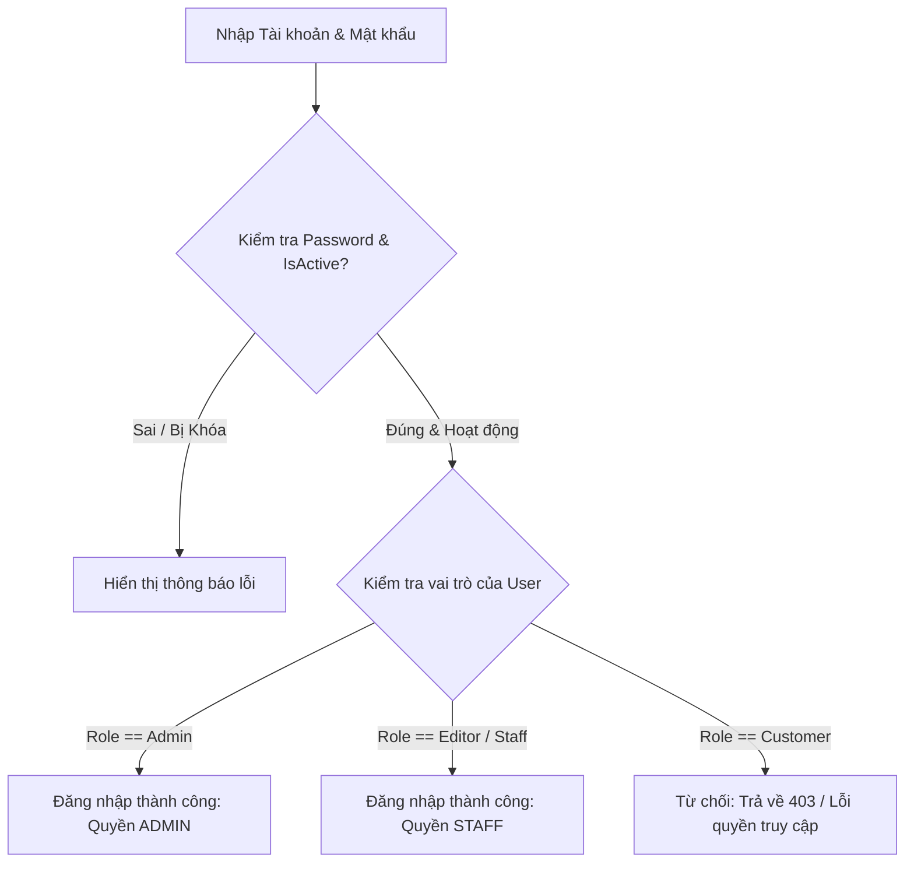

# Báo Cáo Triển Khai Quyền Staff & Mô Hình RBAC (Staff Role & RBAC Implementation Report)

Tài liệu chi tiết về việc khắc phục lỗi đăng nhập của Staff (Editor), cấu trúc phân quyền dựa trên vai trò (RBAC), các thay đổi ở cả Controller và View, cùng kết quả kiểm thử hệ thống FlowerShop.

---

## 1. Nguyên nhân Staff không đăng nhập được

Trước đó, khi triển khai cấm tài khoản Customer đăng nhập vào trang quản trị Admin, hàm `Login` của `AccountController` đã sử dụng cờ kiểm tra cứng:
```csharp
if (user.AuthType != "User" || (user.Role != "Admin" && user.Role != "Staff"))
```
Tuy nhiên, trong cơ sở dữ liệu và cấu hình hệ thống:
- Cấu hình phân quyền Policy `StaffOnly` trong `Program.cs` yêu cầu vai trò `"Admin"` hoặc `"Editor"`.
- Trên giao diện quản lý người dùng, vai trò dành cho nhân viên vận hành (Staff) được lưu dưới tên `"Editor"` (Biên tập viên).
Do đó, khi nhân viên vận hành đăng nhập, vai trò của họ là `"Editor"` nên bị điều kiện kiểm tra trên lọc bỏ (do `"Editor" != "Staff"` và `"Editor" != "Admin"`), dẫn đến lỗi chặn đăng nhập trái phép dù họ là người dùng quản trị hợp lệ.

---

## 2. Các file đã chỉnh sửa (Modified Files)

### Backend Controllers:
- [AccountController.cs](file:///D:/TrenLop/ThucTapTaiTruong/FlowerShop/Flower.Backend/Controllers/AccountController.cs): Cập nhật hàm `Login` để cho phép các tài khoản có vai trò `"Editor"` hoặc `"Staff"` đăng nhập bình thường.
- [ProductController.cs](file:///D:/TrenLop/ThucTapTaiTruong/FlowerShop/Flower.Backend/Controllers/ProductController.cs): Thêm `[Authorize(Policy = "AdminOnly")]` vào action `Delete` để ngăn chặn Staff xóa sản phẩm vĩnh viễn.
- [CategoryController.cs](file:///D:/TrenLop/ThucTapTaiTruong/FlowerShop/Flower.Backend/Controllers/CategoryController.cs): Thêm `[Authorize(Policy = "AdminOnly")]` vào action `Delete`.
- [CategoryProductController.cs](file:///D:/TrenLop/ThucTapTaiTruong/FlowerShop/Flower.Backend/Controllers/CategoryProductController.cs): Thêm `[Authorize(Policy = "AdminOnly")]` vào action `Delete`.
- [CustomerController.cs](file:///D:/TrenLop/ThucTapTaiTruong/FlowerShop/Flower.Backend/Controllers/CustomerController.cs):
  - Chuyển policy lớp từ `AdminOnly` thành `StaffOnly` để Staff có quyền xem danh sách khách hàng.
  - Áp dụng `[Authorize(Policy = "AdminOnly")]` lên các action `Create`, `Edit`, `Delete` để ngăn Staff thêm, sửa hoặc xóa thông tin khách hàng.
- [PromotionController.cs](file:///D:/TrenLop/ThucTapTaiTruong/FlowerShop/Flower.Backend/Controllers/PromotionController.cs): Thêm `[Authorize(Policy = "AdminOnly")]` cho toàn bộ các action thay đổi trạng thái (`Create`, `Edit`, `Delete`, `ToggleActive`). Staff chỉ có quyền chạy action `Index` (Read-only).
- [CouponController.cs](file:///D:/TrenLop/ThucTapTaiTruong/FlowerShop/Flower.Backend/Controllers/CouponController.cs): Thêm `[Authorize(Policy = "AdminOnly")]` cho toàn bộ các action ghi (`Create`, `Edit`, `Delete`, `ToggleActive`). Staff chỉ có quyền chạy action `Index` (Read-only).

### API Controllers:
- [Api/PromotionsController.cs](file:///D:/TrenLop/ThucTapTaiTruong/FlowerShop/Flower.Backend/Controllers/Api/PromotionsController.cs): Thay thế `[Authorize(Policy = "StaffOnly")]` thành `[Authorize(Policy = "AdminOnly")]` đối với các API tạo mới, cập nhật, bật/tắt và quản lý sản phẩm khuyến mãi nhằm chặn gọi trực tiếp từ client.
- [Api/CouponsController.cs](file:///D:/TrenLop/ThucTapTaiTruong/FlowerShop/Flower.Backend/Controllers/Api/CouponsController.cs): Chuyển các endpoint ghi (`Create`, `Update`, `Enable`, `Disable`) sang chính sách `AdminOnly`.
- [Api/FlashSalesController.cs](file:///D:/TrenLop/ThucTapTaiTruong/FlowerShop/Flower.Backend/Controllers/Api/FlashSalesController.cs): Chuyển các API tạo mới và cập nhật Flash Sale từ `StaffOnly` sang `AdminOnly`.

### Razor Views (UI):
- [Views/Shared/_LayoutAdmin.cshtml](file:///D:/TrenLop/ThucTapTaiTruong/FlowerShop/Flower.Backend/Views/Shared/_LayoutAdmin.cshtml): Sử dụng `@if (User.IsInRole("Admin"))` để ẩn menu "Hệ thống" & "Người dùng" khỏi Sidebar đối với Staff.
- [Views/Product/Index.cshtml](file:///D:/TrenLop/ThucTapTaiTruong/FlowerShop/Flower.Backend/Views/Product/Index.cshtml): Ẩn nút "Xóa" sản phẩm đối với tài khoản không phải Admin.
- [Views/Category/Index.cshtml](file:///D:/TrenLop/ThucTapTaiTruong/FlowerShop/Flower.Backend/Views/Category/Index.cshtml): Ẩn nút "Xóa" danh mục blog đối với tài khoản không phải Admin.
- [Views/CategoryProduct/Index.cshtml](file:///D:/TrenLop/ThucTapTaiTruong/FlowerShop/Flower.Backend/Views/CategoryProduct/Index.cshtml): Ẩn nút "Xóa" danh mục sản phẩm đối với tài khoản không phải Admin.
- [Views/Customer/Index.cshtml](file:///D:/TrenLop/ThucTapTaiTruong/FlowerShop/Flower.Backend/Views/Customer/Index.cshtml): Ẩn nút "Thêm khách hàng" và cột "Thao tác" (chứa nút Sửa, Xóa) đối với tài khoản không phải Admin.
- [Views/Promotion/Index.cshtml](file:///D:/TrenLop/ThucTapTaiTruong/FlowerShop/Flower.Backend/Views/Promotion/Index.cshtml): Ẩn nút "Tạo đợt khuyến mãi" và toàn bộ cột "Thao tác" (chứa các nút Sửa, Xóa, Bật/Tắt) đối với tài khoản không phải Admin.
- [Views/Coupon/Index.cshtml](file:///D:/TrenLop/ThucTapTaiTruong/FlowerShop/Flower.Backend/Views/Coupon/Index.cshtml): Ẩn nút "Thêm mã giảm giá" và toàn bộ cột "Thao tác" (chứa các nút Sửa, Xóa, Bật/Tắt) đối với tài khoản không phải Admin.

---

## 3. Quy trình Xác thực & Phân quyền (Authentication & Authorization Flow)

### Luồng Đăng nhập (Admin Login Flow)


### Luồng Phân quyền Endpoint (Authorization Flow)
- Khi một request gửi tới Action:
  1. Kiểm tra chính sách ở Controller level: `[Authorize(Policy = "StaffOnly")]` cho phép cả Admin và Staff đi qua.
  2. Kiểm tra chính sách ở Action level: `[Authorize(Policy = "AdminOnly")]` chỉ cho phép Admin đi qua, Staff (Editor) sẽ bị trả về trang từ chối truy cập (403 Forbidden).

---

## 4. Bảng phân bổ quyền hạn RBAC (Role-Based Access Control)

| Tính năng | Quyền hạn của ADMIN | Quyền hạn của STAFF (Editor) |
| :--- | :--- | :--- |
| **Dashboard** | Toàn quyền (Đọc & Sửa cấu hình) | Chỉ đọc (Read-only) |
| **Đơn hàng (Orders)** | Toàn quyền | Đọc danh sách, Xác nhận đơn, Chuyển trạng thái, Hủy đơn |
| **Sản phẩm (Products)** | Toàn quyền | Đọc danh sách, Tạo mới, Chỉnh sửa (Không được Xóa) |
| **Danh mục (Categories)** | Toàn quyền | Đọc danh sách, Tạo mới, Chỉnh sửa (Không được Xóa) |
| **Bài viết (Posts)** | Toàn quyền | Toàn quyền (CRUD) |
| **Khách hàng (Customers)**| Toàn quyền | Chỉ xem danh sách (Không được Thêm, Sửa, Xóa, Đổi role, Reset pass) |
| **Đánh giá (Reviews)** | Toàn quyền | Xem danh sách, Duyệt đánh giá, Ẩn đánh giá |
| **Khuyến mãi (Promotions)**| Toàn quyền | Chỉ xem danh sách (Không được Tạo mới, Sửa, Xóa, Bật/Tắt) |
| **Mã giảm giá (Coupons)** | Toàn quyền | Chỉ xem danh sách (Không được Tạo mới, Sửa, Xóa, Bật/Tắt) |
| **Flash Sale** | Toàn quyền | Chỉ xem danh sách (Không được tạo/sửa đổi qua API) |
| **Hệ thống & Cấu hình** | Toàn quyền | **Bị cấm hoàn toàn** (Ẩn khỏi Sidebar, Chặn API và Controller) |
| **Quản lý User & Staff** | Toàn quyền | **Bị cấm hoàn toàn** (Ẩn khỏi Sidebar, Chặn API và Controller) |
| **Nhật ký hệ thống (Audit)**| Toàn quyền | **Bị cấm hoàn toàn** (Ẩn khỏi Sidebar, Chặn API và Controller) |

---

## 5. Kết quả kiểm thử (Test Cases & Results)

| STT | Kịch bản kiểm thử | Kết quả thực tế | Trạng thái |
| :--- | :--- | :--- | :---: |
| 1 | Đăng nhập bằng tài khoản Admin | Đăng nhập thành công, hiển thị đầy đủ Sidebar và toàn quyền thao tác. | **Thành công** |
| 2 | Đăng nhập bằng tài khoản Staff (`Editor`) | Đăng nhập thành công, hiển thị trang quản trị, Sidebar không chứa mục "Hệ thống" & "Người dùng". | **Thành công** |
| 3 | Đăng nhập bằng tài khoản Customer vào Admin MVC | Bị chặn ngay từ bước đăng nhập, hiển thị thông báo lỗi phân quyền. | **Thành công** |
| 4 | Staff truy cập mục Khuyến mãi / Mã giảm giá | Chỉ xem được danh sách, nút tạo mới và cột "Thao tác" (Sửa, Xóa, Bật/Tắt) đã bị ẩn hoàn toàn. | **Thành công** |
| 5 | Staff cố tình truy cập URL tạo/sửa khuyến mại (`/Promotion/Create`) | Hệ thống chặn và trả về trang Access Denied. | **Thành công** |
| 6 | Staff cố tình gửi yêu cầu API Tạo khuyến mãi / Flash Sale | API trả về mã lỗi `403 Forbidden` do đã áp policy `AdminOnly`. | **Thành công** |
| 7 | Staff truy cập danh sách Khách hàng | Xem được danh sách, các nút "Thêm mới", "Sửa", "Xóa" đã bị ẩn. | **Thành công** |
| 8 | Staff cố tình truy cập URL quản lý người dùng (`/User`) | Hệ thống chặn và trả về trang Access Denied. | **Thành công** |

---

## 6. Kết quả biên dịch (Build Status)
- Dự án `Flower.Backend` biên dịch thành công: **0 Errors**.
