# Biểu Đồ Tuần Tự (Sequence Diagram) Hệ Thống FlowerShop

## Biểu đồ tuần tự Usecase đăng ký tài khoản

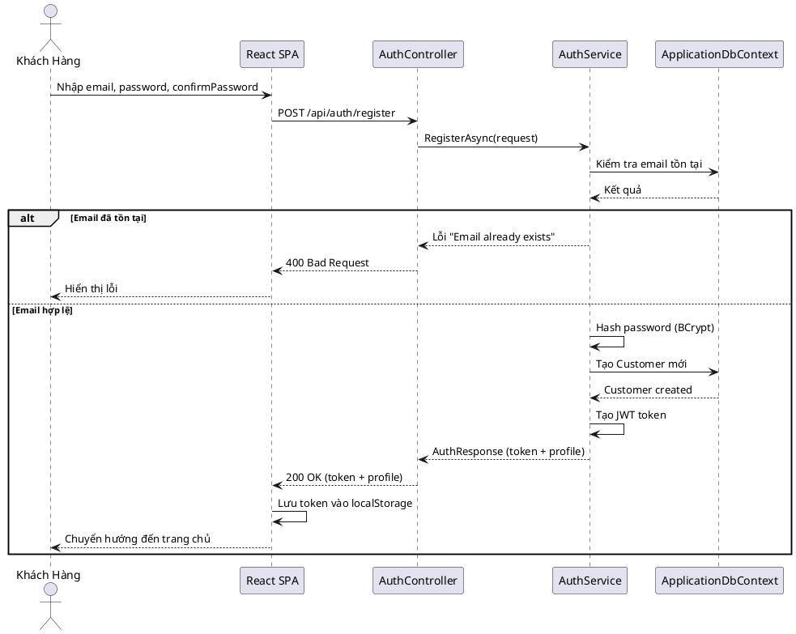
**Hình 13. Biểu đồ tuần tự đăng ký**

---

## Biểu đồ tuần tự Usecase đăng nhập

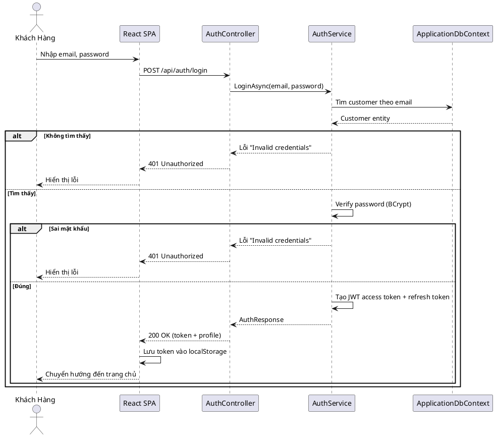
**Hình 14. Biểu đồ tuần tự đăng nhập**

---

## Biểu đồ tuần tự Usecase tìm kiếm sản phẩm

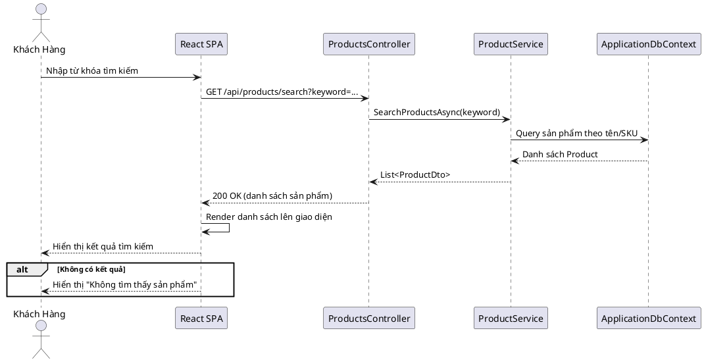
**Hình 15. Biểu đồ tuần tự tìm kiếm**

---

## Biểu đồ tuần tự Usecase quản lý giỏ hàng

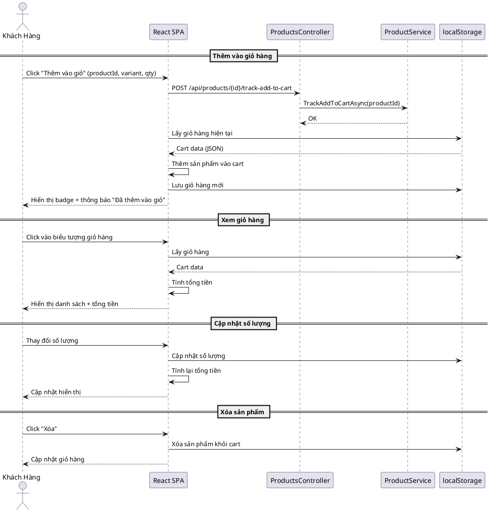
**Hình 16. Biểu đồ tuần tự giỏ hàng**

---

## Biểu đồ tuần tự Usecase đặt hàng

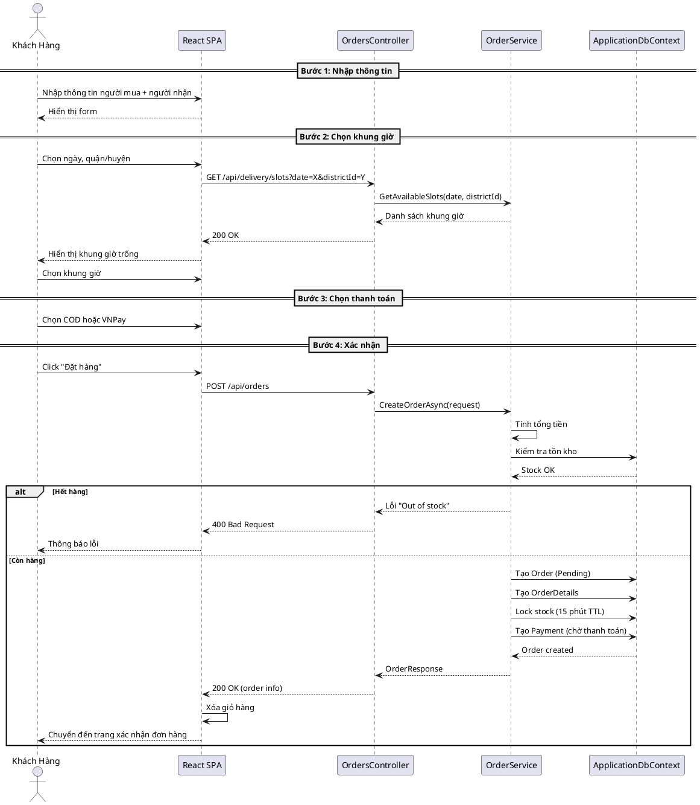
**Hình 17. Biểu đồ tuần tự đặt hàng**

---

## Biểu đồ tuần tự Usecase thanh toán VNPAY

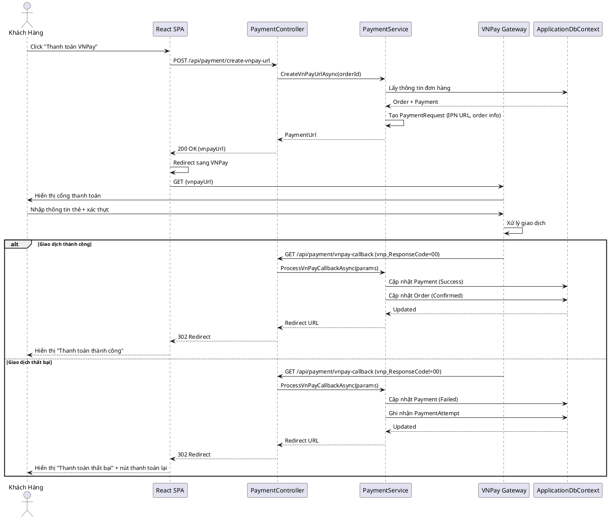
**Hình 18. Biểu đồ tuần tự thanh toán VNPAY**

---

## Biểu đồ tuần tự Usecase thanh toán lại đơn hàng chưa thanh toán

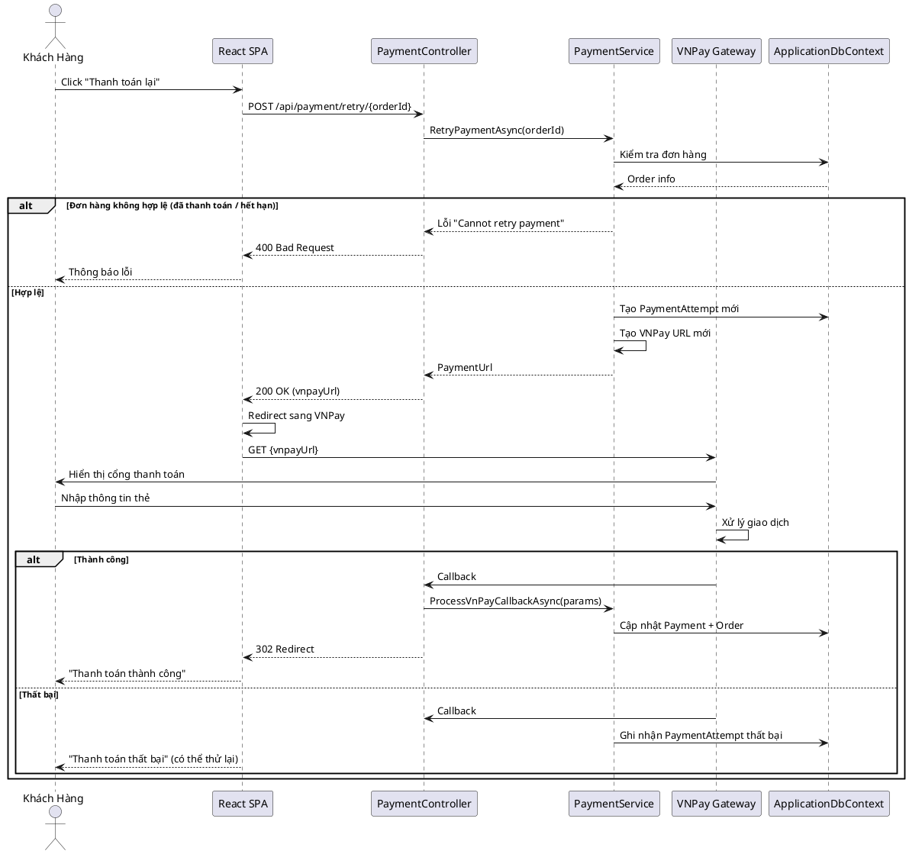
**Hình 19. Biểu đồ tuần tự thanh toán lại**

---

## Biểu đồ tuần tự Usecase hủy đơn hàng

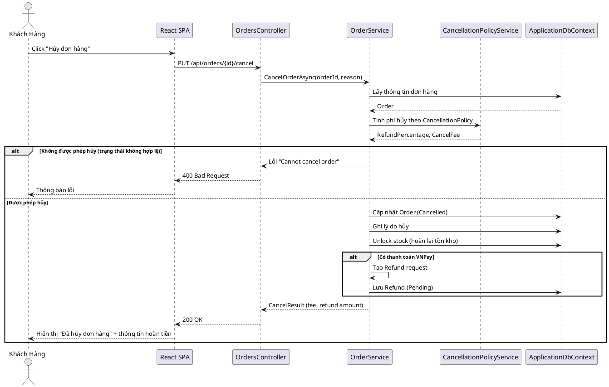
**Hình 20. Biểu đồ tuần tự hủy đơn**

---

## Biểu đồ tuần tự Usecase hoàn tiền

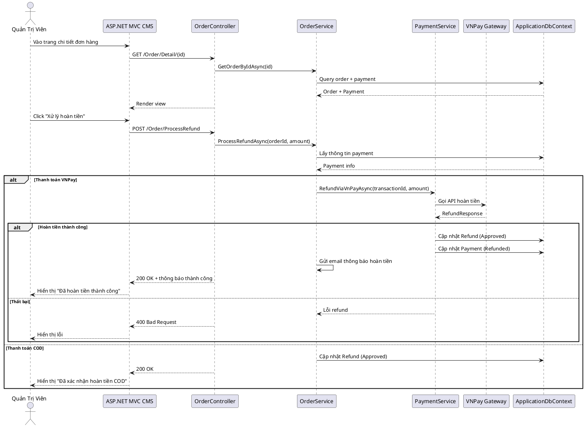
**Hình 21. Biểu đồ tuần tự hoàn tiền**

---

## Biểu đồ tuần tự Usecase quản lý đơn hàng (Admin)

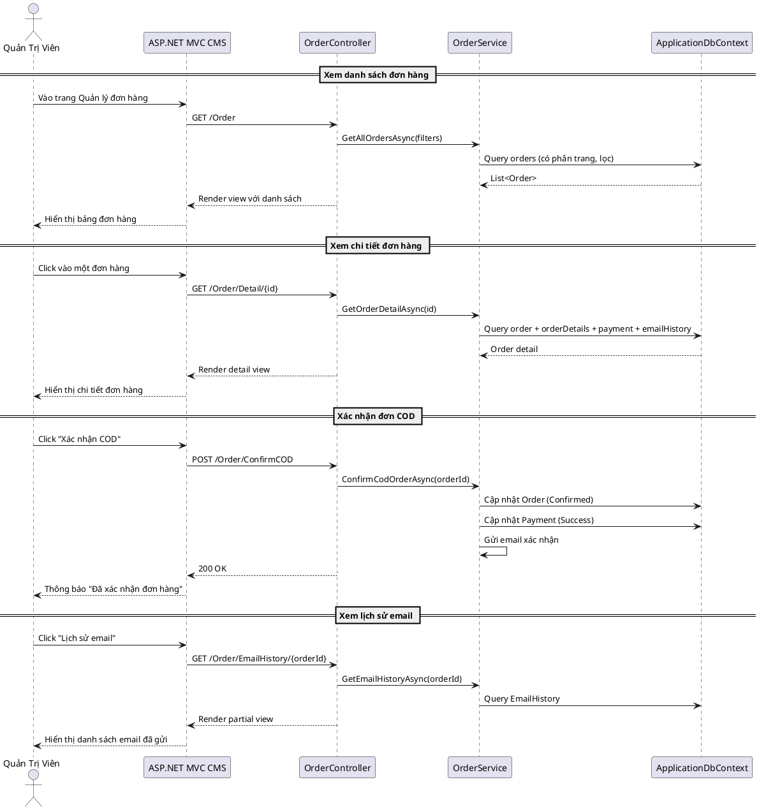
**Hình 22. Biểu đồ tuần tự quản lý đơn hàng**

---

## Biểu đồ tuần tự Usecase cập nhật trạng thái giao hàng

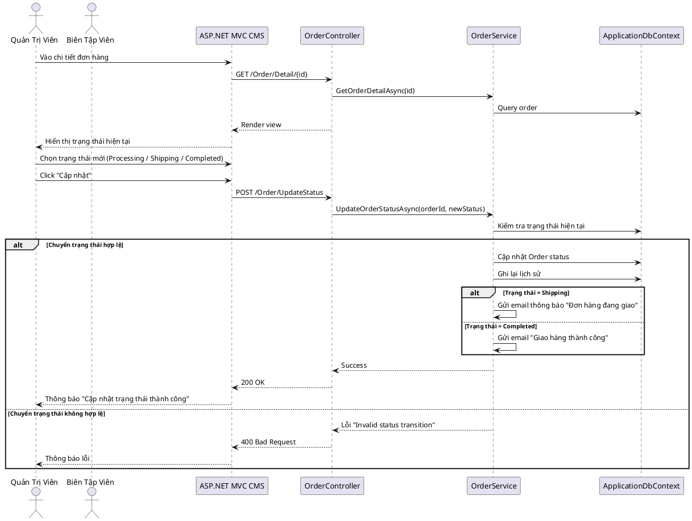
**Hình 23. Biểu đồ tuần tự giao hàng**

---

## Biểu đồ tuần tự Usecase Dashboard thống kê

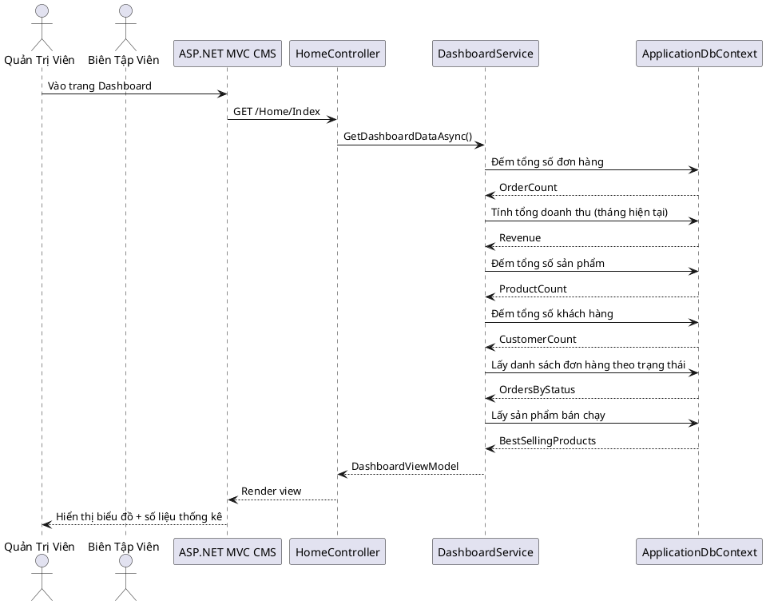
**Hình 24. Biểu đồ tuần tự Dashboard**
