# Biểu Đồ UseCase Hệ Thống FlowerShop

## Biểu đồ Usecase tổng quát

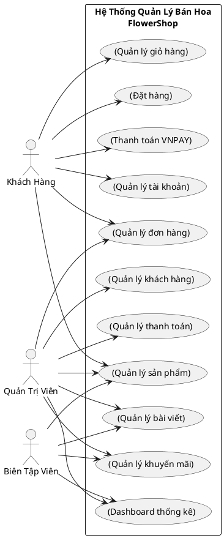
**Hình 1. Biểu đồ Usecase tổng quát**

---

## Biểu đồ Usecase quản lý tài khoản

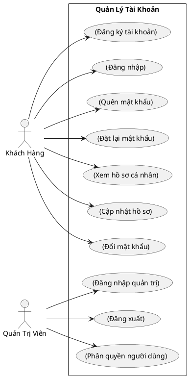
**Hình 2. Biểu đồ Usecase quản lý tài khoản**

---

## Biểu đồ Usecase quản lý sản phẩm

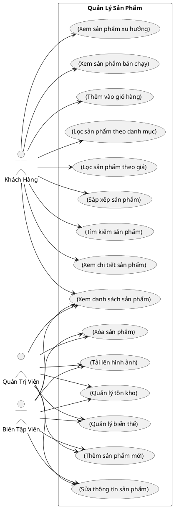
**Hình 3. Biểu đồ Usecase quản lý sản phẩm**

---

## Biểu đồ Usecase quản lý giỏ hàng

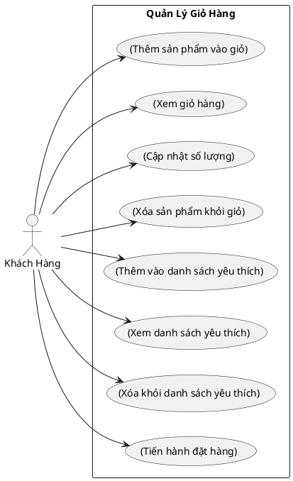
**Hình 4. Biểu đồ Usecase quản lý giỏ hàng**

---

## Biểu đồ Usecase đặt hàng

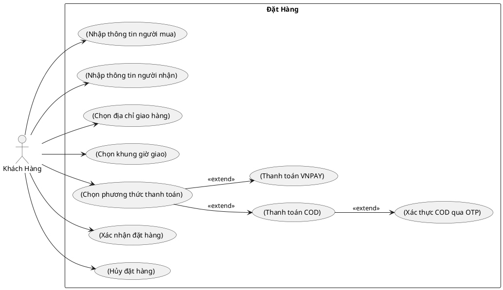
**Hình 5. Biểu đồ Usecase đặt hàng**

---

## Biểu đồ Usecase thanh toán VNPAY

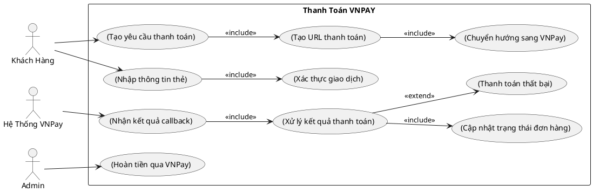
**Hình 6. Biểu đồ Usecase thanh toán VNPAY**

---

## Biểu đồ Usecase quản lý đơn hàng

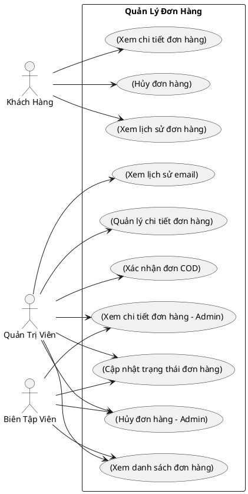
**Hình 7. Biểu đồ Usecase quản lý đơn hàng**

---

## Biểu đồ Usecase quản lý thanh toán

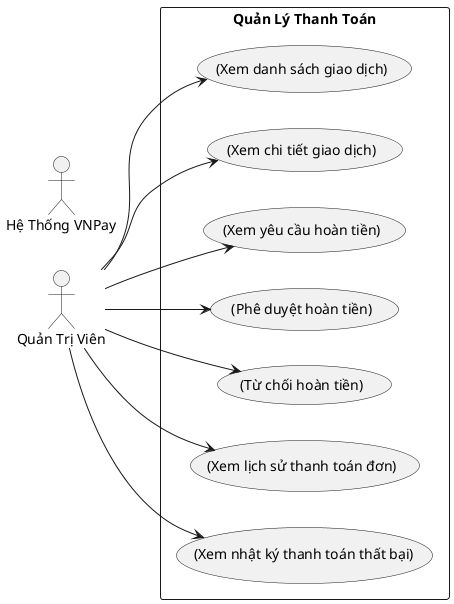
**Hình 8. Biểu đồ Usecase quản lý thanh toán**

---

## Biểu đồ Usecase quản lý khách hàng

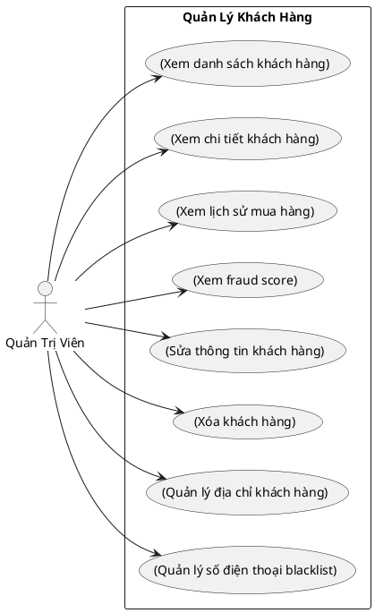
**Hình 9. Biểu đồ Usecase quản lý khách hàng**

---

## Biểu đồ Usecase quản lý bài viết

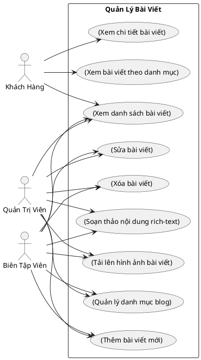
**Hình 10. Biểu đồ Usecase quản lý bài viết**

---

## Biểu đồ Usecase quản lý khuyến mãi

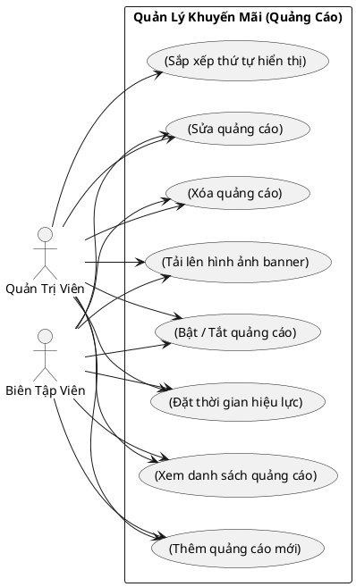
**Hình 11. Biểu đồ Usecase quản lý khuyến mãi**

---

## Biểu đồ Usecase Dashboard thống kê

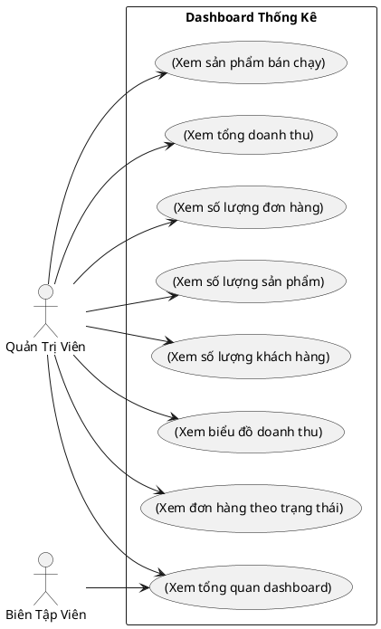
**Hình 12. Biểu đồ Usecase Dashboard thống kê**
